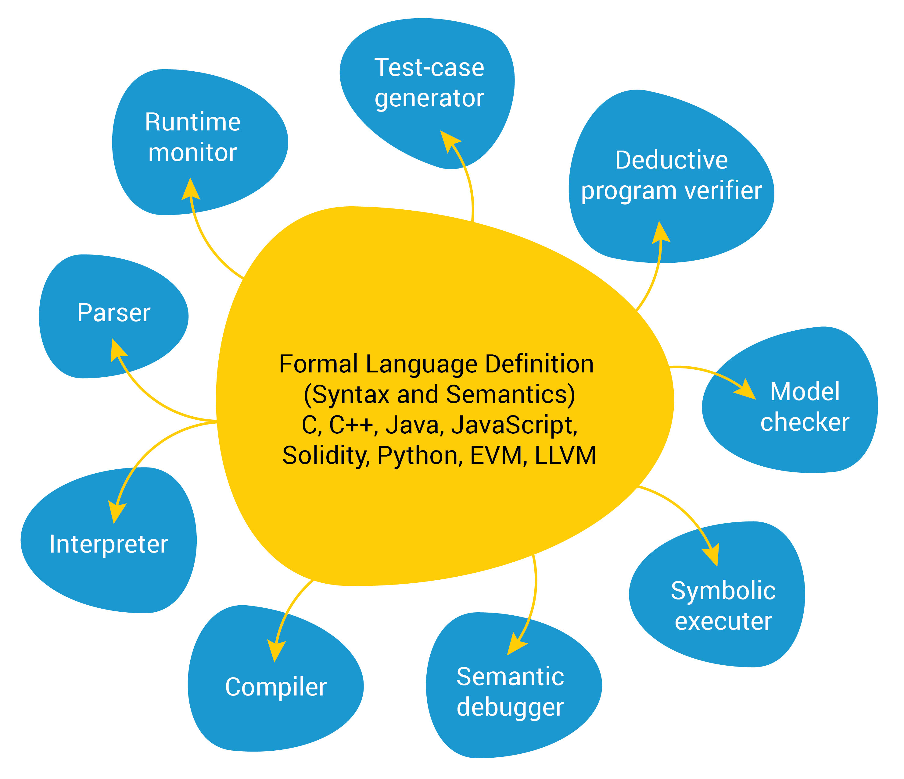

\emergencystretch 5em

# Motivation {#sec:introduction}

The recent proliferation of programming languages has brought into focus the
need for a carefully streamlined language infrastructure.
Computation, and therefore programming languages, have begun to pervade every
domain of our being, from our day-to-day lives in our pockets and our homes,
to financial instruments and quantum computing.
Each of these languages are tailored to their specific domain, and yet, rightfully,
users demand sophisticated tooling for optimized compilation, debugging, model
checking and program verification.
Implementing such tooling on a language-by-language basis is not just redundant,
but also cost-prohibitive.
Creating tooling that provides a depth in terms of quality and complexity,
while still covering this breadth of diversity of languages and their domains
requires that we systematically streamline these redundancies.

We envision an *ideal language framework*, shown in [@fig:ideal-framework],
where a language designer must only provide
a formal description of the syntax
and a formal semantics for their language,
from which language tooling may be automatically generated "for free" by the framework.

{ #fig:ideal-framework width=45% }

The \K{} framework (\url{https://kframework.org}) pursues this vision.
\K{} provides an intuitive meta-language with which language designers
may define the formal semantics of their programming language
as a transition system.
The framework uses this to generate
parsers, interpreters, deductive verifiers [@SPY+16; @Ros17a],
program equivalence checkers [@kasampalis2021language], among others.
This approach is no longer of purely academic interest---diverse and complex programming languages have been specified in \K{}
including [@c-semantics], Java [@java-semantics], JavaScript [@javascript-semantics],
EVM [@evm-semantics] and x86 assembly [@x86-semantics].
The commercial success of verification tools built using this approach (e.g. \url{https://runtimeverifcation.com}) show that these tools are practical, valuable
and in-demand.

In order to provide sound and powerful formal verification tools \K{} needs a firm logical foundation.
Without such a logical foundation the very meaning of what it means for a program to be "verified" or "correct" are in question.

Matching logic [@matchinglogiclmcs; @matching-mu-logic; @matching-logic-explained] provides this foundation.
As shown in [@fig:ml-as-basis-for-k], every \K{} semantic definition of a language $L$ yields a corresponding matching logic theory $\Gamma_L$,
and every language task, such as executing a program or verifying a property, conducted by \K{}
is characterized by checking the validity of a matching logic entailment,
$\Gamma_L \vdash \phi_\mathit{task}$, where $\phi_\mathit{task}$ is the formal specification of the task in matching logic.
These language tasks range from running a program in an interpreter
(i.e. checking if there is a terminating execution trace for a program),
to proving reachability claims.
If these tools emit proof certificates, they may be checked with the matching logic proof checker [@chen-lin-trinh-rosu-2021-cav].

\begin{figure}
\def\svgwidth{\columnwidth}
\newcommand{\kbox}[1]{
    \tikz[baseline=(char.base)]{\node[draw,rectangle,rounded corners=2pt,inner sep=2pt] (char){\phantom{\rlap{yL$._y$}}#1};}
}
\newcommand{\g}[1]{$\Gamma_\text{#1}$}
\input{figs/ml-as-basis-for-k.pdf_tex}
\caption{Matching Logic as the foundation for \K{}}
\label{fig:ml-as-basis-for-k}
\end{figure}

Matching logic provides this foundation by creating a unifying logic, or *lingua franca*, for formal verification.
Constructs for building terms, first-order quantification, and fixedpoints,
allow capturing the many formalisms important to verification,
including linear temporal logic (LTL) [@ltl], computation tree logic (CTL) [@ctl], separation logic (SL) [@separation-logic], and
reachability logic [@matchinglogiclmcs; @matching-mu-logic],
as well as the language-semantics-as-a-theory produced by \K{}.
Together, these may be used to define the various language tasks described above.
It does all this while maintaining minimal *representational distance*---because
it preserves and respects the original syntactic and semantic structures,
such as program ASTs, continuations, heaps and stacks, language semantics may be captured in a compact and modular way.
In fact, the embeddings of many logics are syntactically identical to the original logics.
This is in contrast to approaches that translate these to, say, first-order logic,
that introduce quantifiers and other clutter.

\K{}'s tools are best-effort checking for the validity of these entailments.
Currently, this is done through ad-hoc reasoning developed on an as-needed basis
and translation to SMT-LIB2 [@smtlib] for dispatch to the Z3 solver [@z3].
This leads to quite a few deficiencies---limited support for induction,
users need to spell out many lemmas and simplifications,
caching and optimization are at the mercy of what Z3's incremental interface will accept.
\newline

*Our grand vision is to develop a matching logic solver, systematically and methodically,
that unifies reasoning across embedded logics, and alleviates these problems.*
In [@towards-a-unified-framework], the authors took the first steps in this
effort---they build the foundations for a unified proof framework that allows
fixedpoint reasoning across logics.
The authors developed a set of
high-level (relative to matching logic's own proof rules)
syntax-driven proof system, amenable to automation.
This approach was effective---the framework was evaluated against four logical
systems---first-order logic with fixedpoints, separation logic, reachability
logic, and linear temporal logic (LTL).

However, as admitted in [@towards-a-unified-framework] itself, it would be unreasonable
to hope that at such a nascent stage this framework would be able to compete with
state-of-the-art domain-specific provers and decision procedures.
We, however, believe that such a goal is possible and within reach in the near-term, but will
likely take several years of sustained effort.
Such an effort is worthwhile, because if successful could be transformative to the fields
of automated deduction and program verification.

In this work, we take aim at some shortcomings of this framework.
First, the core of the framework was based on an ad-hoc unfolding of fixedpoints.
The boundaries of where this procedure is complete, and when it would not terminate are not known.
To work around this, an arbitary bound on the number of unfoldings for fixedpoints.
Further, the procedure unnecessarily tried all possible interleavings of unfoldings
leading to poor performance when there were more than a few fixedpoints in the claim. 
Second, the framework peformed poorly with arbitary claims, getting "stuck" when not in a specific normalized form.
Often the simplification procedures weren't powerful enough to re-normalize between applications of these strategies.
\todo{make sure we answer precisely how these are solved later in the paper.}

We propose that this heuristic be replaced with a decision procedure for a fragment of matching logic,
analogously to how  DPLL [@dpll;@dpllt], a decision procedure for propositional fragment of first-order logic,
forms the core of many first-order SMT solvers [@z3;@mathsat4;@cvc4].
Solvers for first-order logic are typically constructed around DPLL,
an algorithm for checking the satisfiability of propositional logic formulae.
A first-order formula is transformed into a propositional "skeleton" by replacing atoms with propositional variables.
The DPLL algorithm then produces solutions to this skeleton---truth assignments to each of the introduced propositional variables.
If any of these solutions are consistent with the atoms from the original formula,
then the entire first-order formula is satisfiable.

Unfortunately, DPLL cannot directly be used in the same way as the core for matching logic automated proving
because matching logic formulae (called "patterns") cannot be reduced to a propositional skeleton.
This is because matching logic patterns are interpreted as the set of elements
they match, unlike propositional variables which are two-valued (either true or false).
In fact, translation to first-order logic or other logics is not desired in general,
because the additional complexity, such as quantifiers,
thwarts the nice properties such as compactness and modularity gained by using matching logic.
In addition, since fixedpoint reasoning is an important aspect of program verification,
the core motivation for matching logic,
and it would be ideal if inductive reasoning is built into this core.
\newline

*In this paper we propose three increasingly powerful decidable fragments of matching logic.*
Despite being redundant, presenting all three fragments allows us to incrementally introduce the techniques used
instead of forcing the reader to deal with the complexity all at once.

\begin{figure}
\def\svgwidth{\columnwidth}
\newcommand{\g}[1]{$\Gamma_\text{#1}$}
\input{figs/decidable-theories.pdf_tex}
\caption{Proposed decidable fragments of matching logic, and some decidable embedded logics they subsume.}
\end{figure}

The first and simplest fragment is called the *modal fragment* and allows neither fixedpoints nor quantification.
To those familiar with modal logic, it may be thought of as a polyadic multimodal form of this logic.
We prove that this fragment is decidable by showing that it has the small-model
property---the size models for satisfiable are bound by a computable function of the size of the pattern.

The second fragment, the *quantifier-free fragment*, extends this to allow
least- and greatest-fixedpoints, the modal $\mu$-calculus extension of modal logic.
This is proved decidable through an extension to the approach
first show in [@games-for-mu-calculus].

The final fragment, called the *guarded fragment*,
allows both fixedpoints and a restricted form of quantification.
Again, this is proved decidable through an extension to the corresponding
decision procedure for guarded fixedpoint logic.
We introduce a resolution-like rule that plays the role of backtracking in DPLL.
It also removes the need to iterate over all possible interpretations
(as required by the algorithm presented by Grädel).
and gives us a tangible object, called a refutation, in case the pattern is unsatisfiable.
We may later work on a way of converting this to a formal proof.
We propose using the presented decision procedure for this fragment as a new
core for the proof framework in [@towards-a-unified-framework].

