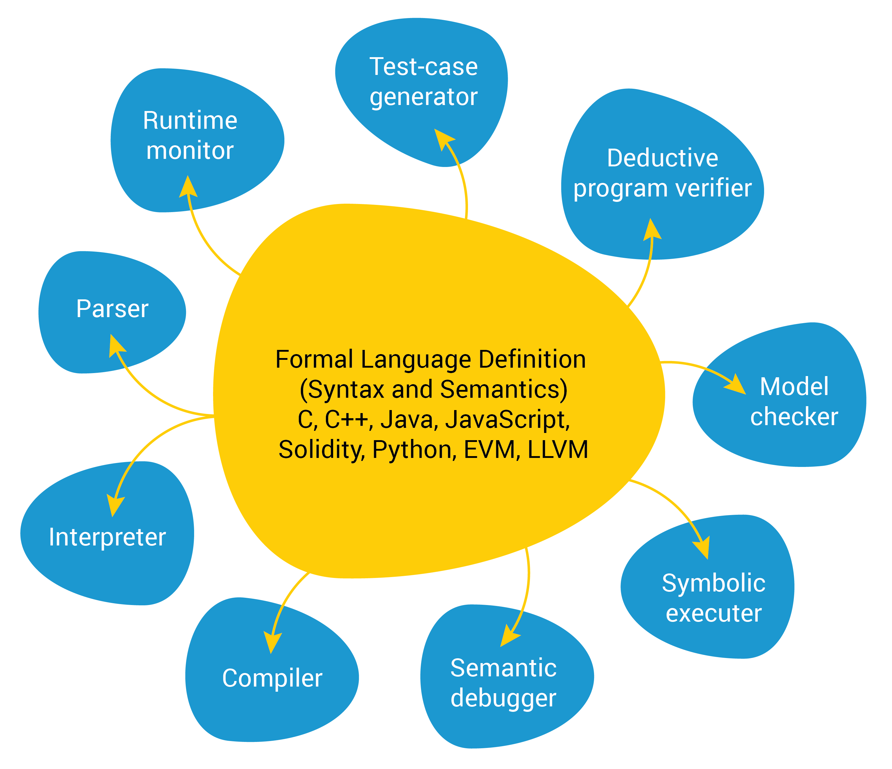
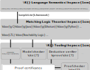
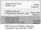

\emergencystretch 5em

# Motivation

The recent proliferation of programming languages has brought into focus the
need for a carefully streamlined language infrastructure.
Computation, and therefore programming languages, have begun to pervade every
domain of our being, from our day-to-day lives in our pockets and our homes,
to financial instruments and quantum computing.
Each of these languages are tailored to their specific domain, and yet, rightfully,
users demand sophisticated tooling for optimized compilation, debugging, model
checking and program verification.
Implementing such tooling on a language-by-language basis is not just redundent,
but also cost-prohibative.
Creating tooling that provides a depth in terms of quality and complexity,
while still covering this breadth of diversity of languages and their domains
requires that we systematically streamline these redundancies.

We envision an *ideal language framework*, shown in [@fig:ideal-framework],
where a language designer must only provide a formal description of the syntax and behaviour for their language,
from which language tooling may be automatically generated "for free" by the framework.

{ #fig:ideal-framework width=45% }

The \K{} framework (\url{kframework.org}) pursues this vision.
\K{} provides an intuitive meta-language with which language designers
may define the formal semantics of their programming language
as a transition system.
The framework uses this to generate
parsers, interpreters, deductive verifiers [@SPY+16; @Ros17a],
program equivalence checkers [@kasampalis2021language], among others.
This approach is no longer of purely academic interest --
diverse and complex programming languages have been specified in \K{}
including C [@c-semantics], Java [@java-semantics], JavaScript
[@javascript-semantics], EVM [@evm-semantics] and x86 assembly
[@x86-semantics].
The commercial success of verification tools built using this approach (\url{runtimeverifcation.com}) show that these tools are practical, valuable
and in-demand.

In order to provide sound and powerful formal verification tools \K{} needs a firm logical foundation.
Without such a logical foundation the very meaning of what it means for a program to be "verified" or "correct" are in question.

Matching logic [@matchinglogiclmcs; @matching-mu-logic; @matching-logic-explained] provides this foundation.
As shown in [@fig:ml-as-basis-for-k], every \K{} semantic definition of a language $L$ yields a corresponding matching logic theory $\Gamma_L$,
and every language task, such as executing a program or verifying a property, conducted by \K{}
is characterized by ichecking the validity of a matching logic entailment,
$\Gamma_L \vdash \phi_\mathit{task}$, where $\phi_\mathit{task}$ is the formal specification of the task in matching logic.
These language tasks range from running a program in an interpreter
(i.e. checking if there is a terminating execution trace for a program),
to proving reachability claims.
If these tools emit proof certificates, they may be checked with the matching logic proof checker [@chen-lin-trinh-rosu-2021-cav].

{ #fig:ml-as-basis-for-k width=45% }

Matching logic provides this foundation by creating a unifying logic, or *lingua franca*, for formal verification.
Constructs for building terms, first-order quantification, and fixedpoints,
allow capturing
the many formalisms important to verification, including LTL, CTL, separation logic, reachability logic
[@matchinglogiclmcs; @matching-mu-logic].
and also the language-semantics-as-a-theory produced by \K{}.
Together, these may be used to define the various language tasks described above.
It does all this while maintaining minimal *representational distance* --
because it preserves and respects the original syntactic and semantic structures,
such as program ASTs, continuations, heaps and stacks, language semantics may be captured in a compact and modular way.
In fact, the embeddings of many logics are syntactically identical to the original logics.
This is in contrast to approaches that translate these to, say, first-order logic,
that introduce quantifiers and other clutter.

\K{}'s tools are best-effort checking for the validity of these entailments.
Currently, this is done through ad-hoc reasoning developed on an as-needed basis
and translation to SMT-LIB2 [@smtlib] for dispatch to the Z3 solver [@z3].
This leads to quite a few deficiencies --- limited support for induction,
users need to spell out many lemmas and simplifications,
caching and optimization are at the mercy of what Z3's incremental interface will accept.

Our grand vision is to develop a matching logic solver, systematically and methodically,
that unifies reasoning across embedded logics, to alleviate these problems.
In [@towards-a-unified-framework], the authors begin such an effort --
they build the foundations for a unified proof framework that allows fixedpoint reasoning across logics.
However, this was built around a naive depth first search over strategies for unfolding fixedpoints
and other simplifications.
This is less than ideal for a couple of reasons.
First, this is ad-hoc.
We do not know the boundaries of where this procedure is complete, and when it would not terminate.
Each of the strategies required that the claim is in a specific normal form,
and often the simplification procedures weren't powerful to re-normalize between applications of these strategies.
Secondly, it is far from efficient -- a lot of time is spent re-proving the the same claim with different unfolding orders.

We propose that this heuristic be replaced with a decision procedure for a core of matching logic,
analogously to how  DPLL [@dpll] forms the core of many SMT solvers [@dpll-core].
Solvers for first-order logic are typically constructed around DPLL,
an algorithm for checking the satisfiability of propositional logic formulae.
A first-order formula is transformed into a propositional "skeleton" by replacing atoms with propositional variables.
The DPLL algorithm then produces solutions to this skeleton -- truth assignments to each of the introduced propositional variables.
If any of these solutions are consistent with the atoms from the original formula,
then the entire first-order formula is satisfiable.

Unfortunately, DPLL cannot directly be used in the same way as the core for matching logic automated proving
because matching logic formulae cannot be reduced to a propositional skeleton.
This is because matching logic patterns are interpreted as the set of elements
they match, unlike propositional variables which are two-valued (true or false).
Translation to first-order logic or other logics is not desired in general,
because of the additional level of complexity added, such as quantifiers,
and because many of its nice properties can be lost in translation.
In addition,
since fixedpoint reasoning is an important aspect of program verification, the core motivation for matching logic,
and it would be ideal if inductive reasoning is built into this core.

In this paper we propose three increasingly powerful decidable fragments of matching logic.
The final fragment, called *guarded matching logic*, allows both fixedpoints and restricted quantification.
We propose using the decision procedure for this fragment as a new core for the prover
analogously to the use of DPLL as the core of SMT solvers.

# Summary of Results

In this paper, we define three increasingly powerful decidable fragments of matching logic.
Presenting this in increasing order of complexity allows us to build up to the
final and most complex proof without introducing all the complexity at once.

{}

For the most part these procedures are incremental extensions of proofs from the corresponding fragments
for first order logic or fixedpoint logic to matching logic.
However, there are some significant innovations we have made:

-   Brought over the concept of refutations from games with mu calculus to guarded logic.
    This removes the need to iterate over all possible interpretations (as required by the algorithm presented by Gradel).
    This gives us a tangible object in case the pattern is unsatisfiable.
    We may later work on a way of converting this to a formal proof.
-   First known implementation of the procedure for guarded logics

\todo{expand}

\clearpage
